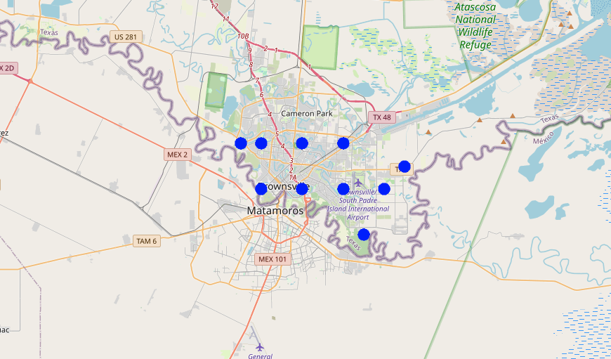

# Amperon Data Engineering Take Home Assignment

This project implements a small system to scrape weather forecasts and historical weather data from the [Tomorrow IO API](https://docs.tomorrow.io/reference/welcome) for a predefined set of geographic locations. The data is stored in a PostgreSQL database and is queryable via SQL. A Jupyter notebook is included for visualizing the results.

---

## **Objective**

The system answers the following questions using SQL:
1. **What’s the latest temperature and wind speed for each geolocation?**
2. **Show an hourly time series of temperature (or any other available weather variable) from a day ago to 5 days in the future for a selected location.**

---

## **System Design**

### **Technologies Used**
- **Python**: The primary language for implementing the solution due to its extensive libraries for HTTP requests, database interaction, and data manipulation.
- **PostgreSQL**: Chosen for its robust SQL querying capabilities, geospatial data support (via `PostGIS`), and compatibility with Docker.
- **Docker & Docker Compose**: Used to containerize the services, ensuring an isolated and reproducible environment.
- **Jupyter Notebook**: Facilitates the visualization of weather data with pandas and matplotlib.
- **Tomorrow IO API**: Provides weather forecast and historical data.

---

### **Components**

#### **1. Python Application**
The main Python script (`__main__.py`) performs the following:
- **Scraping Data**: Fetches hourly weather forecasts for 10 predefined locations using the Tomorrow IO API.
- **Database Storage**: Saves the weather data into PostgreSQL while avoiding duplicate records.
- **Error Handling**: Logs API and database errors for debugging.

#### **2. PostgreSQL Database**
- **Table Schema**:
  - `weather_data`:
    - `id`: Unique identifier for each record
    - `geolocation`: Geospatial data (latitude, longitude) in WGS 84 format
    - `temperature`: Latest temperature (°C).
    - `wind_speed`: Latest wind speed (m/s).
    - `forecast_time`: Timestamp of the forecast.
    - `recorded_time`: Timestamp for when the record is added.

#### **3. Docker Setup**
- **docker-compose.yml**:
  - Defines the services: PostgreSQL database, the Python application and Jupiter Notebook
  - Ensures the system is fully deployable locally.

#### **4. Jupyter Notebook**
- Visualizes:
  - Time series of temperature or other weather variables.
  - Latest temperature and wind speed for all locations.




---

### **Installation and Execution**

#### **Prerequisites**
- Docker
- Docker Compose
- Python 3.8+

#### **Steps to Run**
1. Clone the repository:
   ```bash
   git clone https://github.com/your-repo/amperon-weather-scraper.git
   cd amperon-weather-scraper
2. Create ```.env``` file in root directory and paste your credentials
   ```bash
   cp .env.example .env
   vi .env
   ```
3.	Build and run the services using Docker Compose:
    ```bash
    docker-compose up --build
    ```
4.	Access the Jupyter notebook:
    Open file ```analysis.ipynb``` or navigate to localhost:8888 to access the jupyter notebook server

#### **Rationale Behind Choices**
- Tomorrow IO API: A robust free API providing granular weather data.
- PostgreSQL: Chosen for its geospatial data capabilities with PostGIS extension, enabling efficient location-based queries.
- Python: Its libraries (e.g., requests, psycopg2, matplotlib) streamline API interaction, database communication, and data visualization.
- Docker: Provides reproducibility and simplifies local deployment.

#### **Key Considerations**
1.	Error Handling:
	- API errors (e.g., rate limits) are logged, and retries are implemented for transient errors.
	- Database connectivity issues trigger a retry mechanism.
2.	Scalability:
	- The system can easily scale by extending the Docker Compose configuration to include more services (e.g., caching).
3.	Assumptions:
	- The project does not use cloud services as specified in the requirements.
	- Data storage is limited to the predefined 10 locations.
   - Set a rate limit for API calls on 10 seconds between calls to avoid HTTP 429 error

### **Database Design Choices**

1. **Choosing `geolocation GEOGRAPHY(POINT, 4326)` Instead of Storing Latitude and Longitude as Separate Columns**  
   Using the `GEOGRAPHY` data type for `geolocation` offers several advantages over storing latitude and longitude as separate numeric columns:
   
   - **Spatial Data Type**: The `GEOGRAPHY` type is optimized for handling geographic data and allows us to store both latitude and longitude in a single field. This enables us to leverage the power of PostGIS for spatial queries, making it easier to perform complex operations like proximity searches, distance calculations, and spatial joins.
   - **Accuracy**: The `GEOGRAPHY` type ensures the correct handling of spherical Earth calculations, which is critical when working with coordinates across the globe. It automatically accounts for the Earth's curvature, avoiding the need for custom formulas to compute distances or areas.
   - **Efficient Queries**: Storing the geolocation as a `GEOGRAPHY` point allows us to use spatial indexes and efficient spatial query operations provided by PostGIS, leading to better performance when querying large datasets.

2. **Creating the Spatial Index (`GIST`) on `geolocation`**  
   An index is crucial for improving query performance, especially when dealing with large datasets. By creating a `GIST` (Generalized Search Tree) index on the `geolocation` column, we enable efficient spatial queries such as:
   - **Proximity Search**: Finding nearby weather data points using functions like `ST_DWithin`, which can quickly calculate distances between geospatial points.
   - **Spatial Range Queries**: Efficiently querying data within specific geographic bounds (e.g., a bounding box or circle).
   
   The `GIST` index is well-suited for spatial data types in PostGIS, providing performance improvements when querying or joining on geospatial data, especially with large volumes of weather data.

3. **Using the `postgis` Extension**  
   The PostGIS extension adds support for spatial objects to PostgreSQL, turning it into a powerful geospatial database. It enables the database to store and query geographic data types like `POINT`, `LINESTRING`, and `POLYGON` using SQL. The extension provides advanced spatial functions such as distance calculation, area computation, and topological analysis, which would be much harder to implement manually.
   
   The decision to use PostGIS is based on the need to efficiently handle and query geospatial data, which is essential for the application. By using the extension, we can leverage these built-in functions and improve the scalability and performance of the system.

### **Testing**

6 Tests Implemented
1.	Unit Tests:
	- Validate API response parsing.
	- Ensure database operations (insert/check duplicates) work as expected.
2.	Integration Tests:
	- End-to-end testing of the entire pipeline from API request to database storage.
    ```bash
    pytest tests/
    ```

Future Improvements
1.	Add Caching: Use Redis to reduce redundant API calls for frequently requested locations.
2.	Historical Data: Extend the script to retrieve and store historical weather data.
3.	Cloud Deployment: Transition to AWS or GCP for scalable deployments.